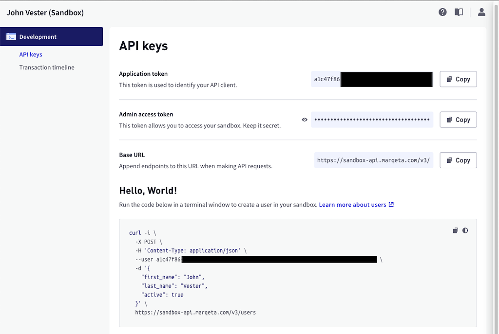

# `marqeta-example` Repository

[](https://gitlab.com/johnjvester/marqeta-example/commits/master)


> Currently, a Java API or `spring-boot-starter-marqeta` does not exist for developers to leverage when communicating 
> with the [Marqeta](https://www.marqeta.com/) modern card issuing platform. The `marqeta-example` repository is a 
> [Spring Boot](https://spring.io/projects/spring-boot) RESTful API which is designed to act as a middleware component 
> to communicate with the Marqeta platform in order to perform a series of financial transactions. The Spring Boot 
> service will allow the ability to list (GET) customers, list (GET) cards, create (POST) just-in-time funding-based 
> transactions, and list (GET) transactions.  Keep in mind, all transactions will be simulated against the Marqeta 
> sandbox platform and not actually communicate with any actual banking institutions.

## Publications

This repository is related to an article published on DZone.com:

* [Leveraging Marqeta to Build a Payment Service in Spring Boot](https://dzone.com/articles/leveraging-marqeta-to-build-a-payment-service-in-s)

To read more of my publications, please review one of the following URLs:

* https://dzone.com/users/1224939/johnjvester.html
* https://johnjvester.gitlab.io/dZoneStatistics/WebContent/#/stats?id=1224939

## Important Information

Before getting started with this repository, access to the Marqeta sandbox is required.  If you do not have an account, 
you can get started at zero cost by creating an account using the link below:

http://app.marqeta.com/

Once your account has been created navigating to the [Development Dashboard](https://app.marqeta.com/development#!) will 
provide details similar to what is displayed below:



Using the information from the Development Dashboard, the following environment settings need to be configured:

* `${APPLICATION_TOKEN}` (`marqeta.application-token`) - the Application token provided in the Marqeta dashboard.
* `${ADMIN_ACCESS_TOKEN}` (`marqeta.admin-access-token`) - the Admin access token provided in the Marqeta dashboard.

Additionally, the following properties exist in the `application.yml`: 

* `marqeta.hostname` - the host name in the Base URL provided in the Marqeta dashboard (value = `sandbox-api.marqeta.com`)
* `marqeta.secure` - boolean to indicate of `https` should be utilized (value = `true`)
* `marqeta.base-url` - the URI portion of the base URL provided in the Marqeta dashboard (value = `/v3`)
* `server.port` - port number for Spring Boot service (value = `9999`)

## Preparing Marqeta For Use 

Before starting the Spring Boot repository, some data needs to be configured in Marqeta, which is summarized in the following illustration:


### Creating a User

Since the User API in the `marqeta-example` repository is focused on listing (GET) existing users, the following `cURL` 
command can be used to create a new user by the name of [Randy Kern](https://twitter.com/randykern):

```shell
curl -i \
  -X POST \
  -H 'Content-Type: application/json' \
  --user APPLICATION_TOKEN_GOES_HERE:ADMIN_ACCESS_TOKEN_GOES_HERE \
  -d '{
    "first_name": "Randy",
    "last_name": "Kern",
    "active": true
  }' \
  https://sandbox-api.marqeta.com/v3/users
```

A successful POST should yield a 2xx response and unique token for Randy Kern:

```json
{
"token" : "1017b62c-6b61-4fcd-b663-5c81feab6524",
"active" : true,
"first_name" : "Randy",
"last_name" : "Kern",
"uses_parent_account" : false,
"corporate_card_holder" : false,
"created_time" : "2021-08-14T13:01:13Z",
"last_modified_time" : "2021-08-14T13:01:14Z",
"metadata" : { },
"account_holder_group_token" : "DEFAULT_AHG",
"status" : "ACTIVE",
"deposit_account" : {
  "token" : "6716c09f-c0dd-430f-ada5-d39f6c5059bb",
  "account_number" : "40018215000000810",
  "routing_number" : "293748000",
  "allow_immediate_credit" : false
  }
}
```

Take note of the `token` value, because it will be required for use later.

### Create a Just-In-Time Funding Source

Next, a funding source is required. For this example, the use of a just-in-time funding source will be used.  Think of the 
just-in-time model when you use a debit card - instead of a gift card which is preloaded with a certain amount.

The following `cURL` command will establish a just-in-time funding source called "funding_source_bank" for this Marqeta sandbox:

```shell
curl -X POST "https://sandbox-api.marqeta.com/v3/fundingsources/program" \
  --user APPLICATION_TOKEN_GOES_HERE:ADMIN_ACCESS_TOKEN_GOES_HERE \
  -H "accept: application/json"  \
  -H "Content-Type: application/json"  \
  -d "{\"name\":\"funding_source_bank\",\"active\":true}"
```

The resulting payload should be similar to what is noted below:

```json
{
  "name": "funding_source_bank",
  "active": true,
  "token": "069e4f6c-a731-48e2-82b7-0df9f44dea62",
  "created_time": "2021-08-15T02:42:06Z",
  "last_modified_time": "2021-08-15T02:42:06Z",
  "account": "12.003.001.000000"
}
```

### Create a Card Product 

A card product links to the just-in-time funding source and a card which belongs to a given user.  The following `cURL` 
command will create a new card product which will utilize the "funding_source_bank" created above:

```shell
curl -X POST "https://sandbox-api.marqeta.com/v3/cardproducts"  \
  --user APPLICATION_TOKEN_GOES_HERE:ADMIN_ACCESS_TOKEN_GOES_HERE \
  -H "accept: application/json"  \
  -H "Content-Type: application/json"  \
  -d '{
       "start_date":"2020-05-01",
       "name":"Funding Source Bank Card",
       "config":{
          "fulfillment":{
             "payment_instrument":"VIRTUAL_PAN"
          },
          "poi":{
             "ecommerce":true,
             "atm":true
          },
          "card_life_cycle":{
             "activate_upon_issue":true
          },
          "jit_funding":{
             "program_funding_source":{
                "funding_source_token":"JUST_IN_TIME_FUNDING_SOURCE_TOKEN_ID_GOES_HERE",
                "refunds_destination":"PROGRAM_FUNDING_SOURCE",
                "enabled":true
             }
          }
       }
    }'
```

This request will yield a `token` as well, which will be utilized in creating a card for Randy Kern.  A portion of the 
resulting payload is display below:

```
{
  "token": "99db1d05-9199-446c-9ff1-047df5ccf154",
  "name": "Funding Source Bank Card",
  "active": true,
  ...
```

### Create a Card

A card in Marqeta is a payment device that enables a user to conduct transactions at merchants. For simplicity, just
think of a card being a debit or credit card. For our example, we are going to create a card from the "Funding Source 
Bank Card" card product established above.

To create a card for Randy Kern, execute the following `cURL` command:

```shell
curl -X POST "https://sandbox-api.marqeta.com/v3/cards"  \
  --user APPLICATION_TOKEN_GOES_HERE:ADMIN_ACCESS_TOKEN_GOES_HERE \
  -H "accept: application/json"  \
  -H "Content-Type: application/json"  \
  -d '{
        "user_token":"RANDY_KERN_USER_TOKEN_GOES_HERE",
        "card_product_token":"FUNDING_SOURCE_BANK_CARD_PRODUCT_TOKEN_GOES_HERE"
    }'
```

A payload similar to what is shown below should appear:

```json
{
  "created_time": "2021-08-15T02:47:52Z",
  "last_modified_time": "2021-08-15T02:47:52Z",
  "token": "9d32f3b7-2fb6-43ec-b4a8-99fc81312301",
  "user_token": "1017b62c-6b61-4fcd-b663-5c81feab6524",
  "card_product_token": "99db1d05-9199-446c-9ff1-047df5ccf154",
  "last_four": "4445",
  "pan": "111111______4445",
  "expiration": "0825",
  "expiration_time": "2025-08-31T23:59:59Z",
  "barcode": "11195778081390829687",
  "pin_is_set": false,
  "state": "ACTIVE",
  "state_reason": "New card activated",
  "fulfillment_status": "ISSUED",
  "instrument_type": "VIRTUAL_PAN",
  "expedite": false,
  "metadata": {}
}
```

At this point, we are ready to use the Spring Boot service.

## Validating Connectivity to Marqeta From the Spring Boot Service

Upon starting the Spring Boot service, the `/ping` URI can be called to validate connectivity to the Marqeta platform.

Using the default setting the following `cURL` command can be executed once the Spring Boot API is running:

```shell
curl --location --request GET 'localhost:9999/ping'
```

A 200 response and a payload similar to what is displayed below will appear if there are no issues:

```json
{
    "success": true,
    "version": "rel-21.7.1",
    "revision": "7b6bf2842d024b0d26f5e29f5cc50617b0d49872",
    "timestamp": "Fri Jul 16 22:37:50 UTC 2021",
    "env": "sandbox",
    "id": "i-0e0a4a9bc40f8d05d:us-east-1a:10.128.19.176"
}
```

## Using the Spring Boot Service

With the Marqeta data validated and connectivity verified, the other URIs are ready for use.

### Viewing Marqeta Data Via the Spring Boot Service

The Spring Boot service currently provides GET functionality for the following Marqeta objects:

* Users configured in the Marqeta platform (Randy Kern)
* Locate a single user for a given user token
* Cards associated with a given user token
* Payment cards associated with a given user token
* Transactions associated with a given user token

The following `cURL` command will return a list of users:

```shell
curl --location --request GET 'localhost:9999/users'
```

The following `cURL` command will return user information associated with the Randy Kern user token:

```shell
curl --location --request GET 'localhost:9999/users/1017b62c-6b61-4fcd-b663-5c81feab6524'
```

The following `cURL` command will provide a list of cards associated with the Randy Kern user token:

```shell
curl --location --request GET 'localhost:9999/cards/user/1017b62c-6b61-4fcd-b663-5c81feab6524'
```

The following `cURL` command will provide a list of *payment* cards associated with the Randy Kern user token:

```shell
curl --location --request GET 'localhost:9999/paymentcards/user/1017b62c-6b61-4fcd-b663-5c81feab6524'
```

The following `cURL` command will provide a list of transactions associated with the Randy Kern user token:

```shell
curl --location --request GET 'localhost:9999/transactions/user/1017b62c-6b61-4fcd-b663-5c81feab6524'
```

### Posting Marqeta Transactions Using the Spring Boot Service

The Spring Boot service currently provides a simple POST command to create a new transaction on the Marqeta platform, which 
utilizes the following `MarqetaTransactionRequest` request body payload.  The example below is for a $7.50 (USD) transaction 
to The Friendly Tavern located in Zionsville, IN:

```json
{
    "amount": "7.50",
    "mid": "11111",
    "card_token": "9d32f3b7-2fb6-43ec-b4a8-99fc81312301",
    "card_acceptor": {
        "name": "The Friendly Tavern",
        "address": "290 S. Main St",
        "city": "Zionsville",
        "state": "IN",
        "zip": "46077",
        "country": "USA"
    },
    "webhook": {
        "endpoint": "https://mywebook.url.goes.here.com",
        "username": "some_username",
        "password": "some_password"
    }
}
```

The payload above can be included in the following `cURL` statement to leverage the Authorization API in the Spring Boot 
service:

```shell
curl --location --request POST 'localhost:9999/authorization' \
  --user APPLICATION_TOKEN_GOES_HERE:ADMIN_ACCESS_TOKEN_GOES_HERE \
  --H 'accept: application/json' \
  --H 'Content-Type: application/json' \
  --d '{
        "amount": "7.50",
        "mid": "11111",
        "card_token": "CARD_TOKEN_GOES_HERE",
        "card_acceptor": {
            "name": "The Friendly Tavern",
            "address": "290 S. Main St",
            "city": "Zionsville",
            "state": "IN",
            "zip": "46077",
            "country": "USA"
        },
        "webhook": {
            "endpoint": "SOME_WEBHOOK_URL_GOES_HERE",
            "username": "USERNAME_GOES_HERE",
            "password": "PASSWORD_GOES_HERE"
        }
    }'
```

Upon a successful POST submission, the full details of this transaction will be displayed.  Additionally, the Transactions 
API can be utilized to view all transactions associated with the Randy Kern user.

## Additional Information

Made with <span style="color:red;">♥</span> &nbsp;by johnjvester@gmail.com, because I enjoy writing code.
